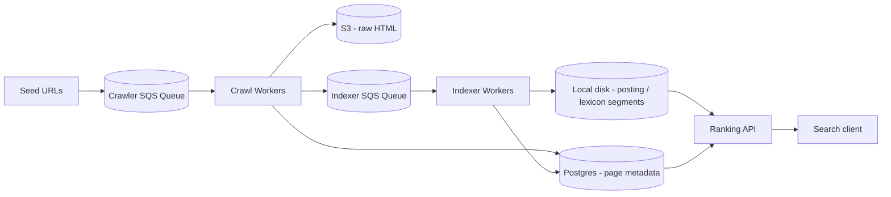

# Yoink - Golang Native Search Engine

<p align="center">
  <strong>A distributed web search engine built from scratch in Go</strong><br>
  Discovers, crawls, validates, indexes, and ranks pages across the web using cloud-native infrastructure.
</p>

<p align="center">
  <a href="https://go.dev/">
    
  </a>
  <a href="./LICENSE">
    
  </a>
  <a href="https://aws.amazon.com/">
    
  </a>
</p>

---

## Contents

- [Overview](#overview)
- [Architectural diagram](#architectural-diagram)
- [Detailed architecture](#detailed-architecture)
  - [Crawling](#crawling)
  - [Indexing](#indexing)
  - [Ranking](#ranking)
- [Storage](#storage)
- [How to read this repo](#how-to-read-this-repo)
- [Getting Started](#getting-started)
- [Running Yoink](#running-yoink)
- [API Reference](#api-reference)
- [Known Limitations](#known-limitations)
- [Contributing](#contributing)
- [License](#license)

---

## Overview

Yoink is an independent search engine that builds every layer of a search engine from scratch instead of wrapping an existing one: URL discovery, distributed crawling, validation, url extraction, deduplication, a built from scratch segmented inverted index, BM25 ranking, and a small HTTP search API.

The system is built around **two decoupled SQS queues** and stateless Go worker pools, so crawling, indexing, and query serving each can scale and deploy independently.

---

## Architectural diagram



## Detailed architecture

### Crawling

A "crawl worker" is a small program that loops through one simple job: grab a URL, download it, save what it finds. `seed.Crawler()` starts many of these worker goroutines in parallel (`WORKERS` of them), all pulling from a shared queue instead of one worker working through a list alone — making the crawling "distributed".

There are two modes, controlled by a flag called `IsDiscovering`. In **discovery** mode, whenever a worker downloads a page, it also looks at the links on that page and adds upto 30 of them back onto the queue to be visited later — this is how the crawler finds new pages instead of only ever visiting a fixed starting list. This continues until the queue grows to a configured size (`NO_OF_SQS_MESSAGES` - a million initially), at which point the crawler switches to **drain** mode: workers keep visiting whatever's left in the queue, but stop adding new links, so the queue only shrinks from there.

To avoid visiting the same page twice, every URL is checked against a Redis hash cache before it's downloaded. That check has a TTL of 7 days, so a page can naturally get recrawled and refreshed later rather than being permanently skipped. The crawler also respects each site's `robots.txt` rules (fetched once per site and cached). Once a page is downloaded and saved, it's pushed to the indexer queue, which the indexer picks up from.

### Indexing

This is the part that makes searching fast, so it's worth walking through from scratch — including how the on-disk index is actually laid out.

**What's an inverted index, in plain terms?** An inverted index maps "words to pages" rather than "pages to words," much like the index at the back of a book. This structure allows the search API to instantly find pages containing a specific term without rescanning the entire corpus.

**Turning a page into words.** Before a downloaded page can go into the index, `seed.IndexerSeed()` cleans it up — stripping things like `<script>` tags, navigation menus, and footers that aren't real content, then breaks what's left into individual words. It tokenizes the remaining text, lowercases it, removes common filler words, and applies stemming. Not every word counts equally either: a word in the page title is weighted 5× as heavily as the same word in the body text, and a word in the description counts 3× — the idea being that where a word appears is itself a signal of how relevant it is.

**Buffering in memory, then writing to disk as segments.** Rather than writing to disk for every single word on every single page, Yoink keeps a running tally in memory (a Go map) as pages get processed. Once every `POSTING_THRESHOLD` pages (10,000 by default), that map gets flushed to disk as a permanent, never-edited-again **segment**, and a fresh empty map starts for the next batch. It is the same underlying architecture used by Lucene and similar engines, and it keeps writes simple to get right even with many pages being indexed concurrently.

Each segment is a pair of files on disk:

- **`posting(i).bin`** — Maps each word to a list of pages and its frequency on those pages.

- **`lexicon(i).bin`** — An alphabetical list of all words in the segment, pointing to their exact locations in the posting file. This alphabetical sorting enables fast, dictionary-style `binary searches`.

Alongside all this, a running average document length is kept up to date in Postgres with one lightweight update per batch.

### Ranking

When someone searches, `GET /api/query` breaks the search text into tokens the same way the indexer does. Then, for **each token** in the query, it checks every segment's lexicon for that word and, if found, reads just that word's entries from the matching posting file — never a whole segment, just the small slice that matters.

Effectively reducing the time complexity from O(n) to O(logn), thanks to binary search.

The matches from every segment are combined into one list of pages (and how often the word appeared in each), and every page gets a relevance score using the **BM25** ranking algorithm.

In plain terms: a page scores higher the more times a search word appears in it. Rarer words across the whole site weight more than common ones, and the score adjusts for page length, so a short, focused page isn't unfairly outranked by a long page that happens to mention a word once.

<a href="https://en.wikipedia.org/wiki/Okapi_BM25">Read more on the BM25 Ranking algorithm...</a>

Once every query word has been scored against every matching page, the per-word scores are added up per page, sorted highest first, de-duplicated by URL, and the top results are fetched from Postgres for their title and description before being returned. The response also includes a timing breakdown of each step, which is handy for spotting exactly where a slow query is spending its time.

## Storage

| Store                          | Holds                                        |
| ------------------------------ | -------------------------------------------- |
| Postgres (RDS)                 | Page metadata, corpus stats, segment counter |
| S3                             | Raw crawled HTML                             |
| Redis                          | URL "already seen" hash cache                |
| Upstash Redis                  | robots.txt cache                             |
| Local disk (`~/indexer_data/`) | Posting/lexicon segments, `docMeta.bin`      |

---

## How to Read This Repo

If you're new to the codebase, reading in this order roughly follows one unit of work through each stage of the pipeline:

1. **`main.go` + `app/app.go`** — the boot sequence every mode shares.
2. **`crawler/crawler.go` → `validate/` → `extract/` → `store/`** — one crawl cycle end to end.
3. **`seed/crawler_seed.go`** — how many of those cycles run concurrently, and how the frontier is bounded.
4. **`indexer/indexer.go` → `word_processing/` → `store/disk/`** — one indexing cycle end to end.
5. **`ranking/ranking.go` → `fetch/` → `load/` → `computation/` → `sort.go`** — one query end to end.
6. **`models/`** — read alongside the above, these are the shared vocabulary between packages.
7. **`utils/`** — read whenever needed, houses utilities

---

## Getting Started

**Prerequisites:** Go 1.24+ (`go.mod` targets `1.26.2`), Postgres, Redis, an Upstash Redis database, an AWS account (SQS + S3), and optionally a [Resend](https://resend.com) API key.

```bash
git clone https://github.com/DarrylMathias/yoink.git
cd yoink
go mod download
cp .env.example .env      # fill in DB_*, AWS_*, *_SQS_NAME, S3_BUCKET_NAME, REDIS_*, UPSTASH_*
go build -o yoink .
```

`.env.config` ships with production defaults (60 workers, a 1.5M-URL frontier cap, 10k-doc flush threshold).

Note: the AWS region is hardcoded to `ap-south-1` in `utils/myaws/config.go`.

**Before first run**, `AutoMigrate` creates the `corpus_statistics` table but doesn't seed a row, and every segment/corpus lookup does `WHERE id = 1`:

Run this query initially:

```sql
INSERT INTO corpus_statistics (id, total_documents, segment_id, average_doc_length)
VALUES (1, 0, 0, 0);
```

---

## Running Yoink

Yoink runs as three roles sharing one codebase. `main.go` currently holds the **query API** by default; the crawler and indexer are loops in the `seed` package. Configure main at the respective stages as follows:

```go
// query API (current default)
app.App(); ranking.Init(); router.RegisterRoutes(e); e.Start(...)

// crawler workers
app.App(); seed.Crawler()

// indexer workers
app.App(); seed.IndexerSeed()
```

One-time jobs: `seed.SeedSQS()` seeds the initial crawl queue; `seed.IndexerSeedSQS()` re-pushes every existing page onto the indexer queue (e.g. to reindex after a tokenizer change).

---

## API Reference

| Method | Path                         | Description                                                                   |
| ------ | ---------------------------- | ----------------------------------------------------------------------------- |
| `GET`  | `/api/`                      | Health check                                                                  |
| `GET`  | `/api/query?q=<terms>&k=<n>` | BM25 search — `q` required (max 100 characters), `k` required (capped at 100) |
| `GET`  | `/api/crawledPages`          | Total crawled page count                                                      |

```bash
curl "http://localhost:8080/api/query?q=distributed+systems&k=10"
```

---

## Known Limitations

- **Messages are deleted before processing is confirmed successful** — `crawler.Crawl` deletes the SQS batch in a `defer` that fires even if extraction/storage fails, so failed pages are deleted, not retried.
  Proper error propogation of essential errors and non essential ones is needed to differentiate when to delete the batch and when not to.
- **`StoreInDisk` hardcodes `/home/ubuntu/indexer_data`** for its `MkdirAll` call, while reads/writes use the current OS user's home dir (`GetRootPath()`) — only matches by coincidence on the `ubuntu` EC2 deployment.
- **`gorm:"unique, not null"`** (comma, not semicolon) on `Page.Url`/`Url_hash` isn't enforcing a real constraint, since GORM splits tag options on semicolons.
- **No automated tests** in CI yet.

---

## Contributing

Fork, branch, raise a PR `main` — CI runs `go build` on every push (no lint/test yet). Keep diffs minimal and follow existing package boundaries (`crawler/extract/download`, etc.) rather than introducing new ones.

The [Known Limitations](#known-limitations) list above is a good source of `good first issues`, any efforts made towards resolving them is highly appreciated.

---

## License

Apache 2.0 License — see [LICENSE](./LICENSE).
